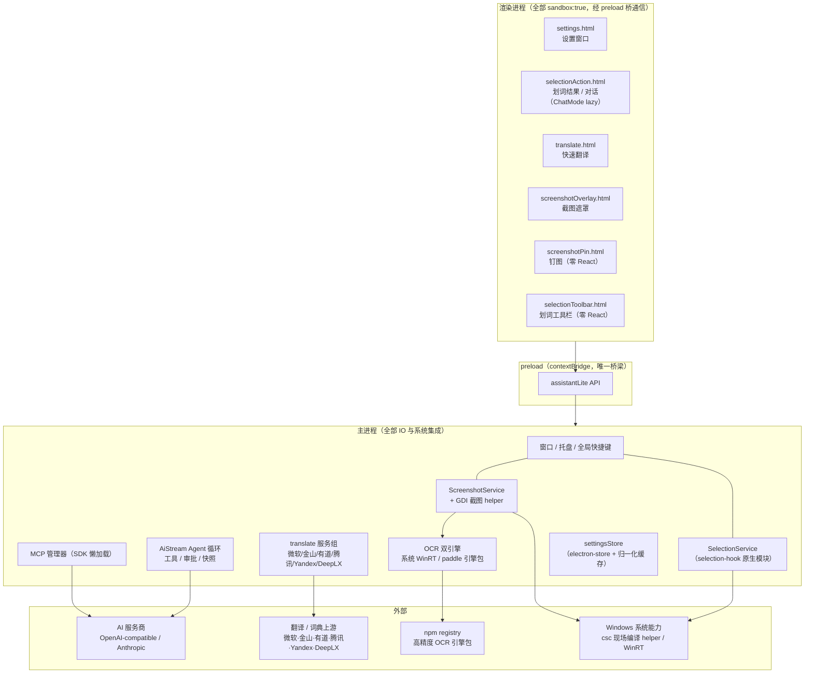

# 系统架构全景 (Architecture Overview)

> 本文只记录"看代码看不出来"的内容：系统全景、模块职责边界、跨模块依赖规则与关键数据链路。函数级细节以源码为准。
> 更新时机：进程模型、模块边界或核心数据流变化时（并按 AGENTS.md 的文档同步红线执行）。

## 1. 系统全景架构

## 2. 模块划分与依赖边界

- **`src/renderer/`（渲染进程）**：6 个 HTML 入口对应 6 个窗口。只通过 `window.assistantLite`（preload 暴露）与主进程通信，**没有任何直连 Node 或网络的能力**（sandbox 开启）。工具栏与钉图窗口刻意保持零 React 纯内联 JS，以求毫秒级打开；其余窗口共享 React（Rollup 自动抽共享 chunk）。新功能不加 HTML 入口，用 `React.lazy` 组件挂进现有窗口。
- **`src/preload/`（唯一桥梁）**：`contextBridge.exposeInMainWorld('assistantLite', api)`，全部 IPC 调用的类型出口（`AssistantLiteApi`）。事件监听一律返回退订函数。渲染器代码出现 `ipcRenderer` 即为越界。
- **`src/main/`（主进程）**：所有文件、网络、系统集成与常驻状态的归属地。按域分文件（`SelectionService`、`ScreenshotService`、`ocr/`、`translate/`、`agent/`、`mcp/`、`ai/`），IPC 注册集中在各域的 register 函数与 `index.ts`。
- **`src/shared/`（双端共享）**：类型定义、IPC 通道名常量、纯函数（设置归一化、翻译语言映射、上下文计量等）。**禁止 import electron 或 Node API**——它被 vitest 直接测试，也被渲染端引用。
- **依赖方向规则**：renderer → preload API → main；shared 被三者引用但不引用三者。主进程域模块之间允许调用，但设置读取统一走 `settingsStore.getSettings()`（带归一化缓存），禁止各自直读 electron-store。

## 3. 关键数据流向 (Core Data Flow)

- **划词问答**：`selection-hook`（原生全局钩子）→ `SelectionService`（主进程）→ 划词工具栏窗口 → 用户选动作 → `SelectionProcessAction` IPC → 复用 action 窗口（`selectionAction.html`）→ `AiStream` IPC → 主进程 Agent 循环调 AI 服务商 → chunk 流式回传。
- **截图识别文字**：热键 → `ScreenshotService.startCapture` → GDI helper exe（`csc.exe` 现场编译，写临时 PNG，读入内存后立即删除）→ 全屏遮罩选区 → confirm 后主进程裁剪 → 按 `settings.ocrEngine` 分发：系统引擎（`WinRtOcr.exe`，PNG 走 stdin）或 paddle 引擎包（userData 内按需下载）→ 文本进剪贴板 + toast。
- **快速翻译**：回车 → `translate:run` → 主进程**并行**执行所有启用服务（每服务独立 15s 超时与 AbortController）→ 逐服务回 `translate:chunk` → 渲染层按 `serviceId` 更新卡片；词典卡片附带生词本自动收录钩子。
- **Agent 工具调用**：模型工具调用 → `validateAgentToolArgs` → 风险分级（forbidden 直接拦截 / dangerous 强制审批）→ 审批卡片（IPC 等待用户决定）→ 执行并落盘快照（可回退）与工具输出（截断至 12k 回传）。

## 4. 核心抽象与设计模式

- **IPC 契约三件套**：`shared/ipc.ts` 通道名常量 + `shared/types.ts` 载荷类型 + preload 的类型化封装。新增通道必须三处同步。
- **设置归一化**：`shared/actions.ts` 的 `normalizeSettings` 是所有设置读取的唯一入口（mergeSettings + 字段级白名单），损坏的 settings.json 不应导致崩溃；`settingsStore` 缓存归一化结果，仅在写回时失效。
- **词典数据快照**：`DictEntry` 是生词本保存的最小完整快照（音标/释义/词形，有道额外含短语与例句）；显示层裁剪（如释义取前 3 条）只发生在渲染层，快照保存完整数据。
- **可选重能力 = 按需下载**：高精度 OCR 引擎包不随安装包分发，运行时从 npm registry 拉取（sha512 校验 + 系统 tar 解包 + `engine.json` 原子标记）到 userData；加载用「变量说明符 + `@vite-ignore`」的运行时动态 import 绕过 CJS/ESM 边界。
- **Windows 原生能力 = 零依赖 helper**：截屏与系统 OCR 都用「C# 源码常量 + 本机 .NET Framework csc.exe 现场编译 + 缓存到 userData/bin」模式；WinRT 互操作不用 `System.Runtime.WindowsRuntime` 的 await 扩展（类型身份是 Win8 单体 winmd，Win10/11 编译不过），用 `Completed` + `GetResults()` 阻塞等待。

## 5. 外部依赖与集成点

- **AI 服务商**：OpenAI-compatible（`/chat/completions` 流式）与 Anthropic；代理链（手动 > 系统 > 直连）统一在 `proxy.ts` 应用，Node 侧走 undici 全局 dispatcher。
- **翻译/词典上游**：均为逆向 Web API（无官方 SLA），各自需要签名或固定请求头；有道 dictvoice 音频有防盗链，经主进程代理换 data URL。
- **MCP**：`@modelcontextprotocol/sdk` 懒加载（首次连接才 import），远程 MCP 走 undici 代理。
- **OS 集成**：`selection-hook`（划词，Windows/macOS 双实现）、`csc.exe` 编译的 helper、`Windows.Media.Ocr`、系统托盘与全局快捷键。

## 6. 技术债务与已知取舍

- **主进程依赖散装进 asar**（`externalizeDepsPlugin`，约 3,500 文件）：改为捆绑可再减体积并小幅加快冷启动，但 MCP/undici/conf→ajv 打包有坑，已决定推迟。
- **ChatMode 单文件约 2,400 行**：已做消息体级 memo 化，完整按域拆分等新功能页面需求明确后进行。
- **darwin 引擎包路径未实机验证**：引擎包 manifest 支持 macOS，但没有 macOS 机器跑过完整下载→加载→识别链路。
- **速度 vs 内存取舍**：设置窗口隐藏 60s 后销毁（省内存，重开数百 ms）；划词结果窗口未做预热池（避免常驻渲染进程）。托盘常驻依赖 `window-all-closed` 处理器，勿删。
- **`--max-old-space-size=512`**：为 4K 截图 dataUrl 预留的有意上限，非泄漏症状。
