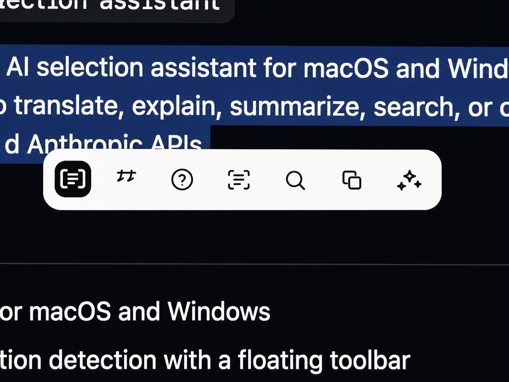
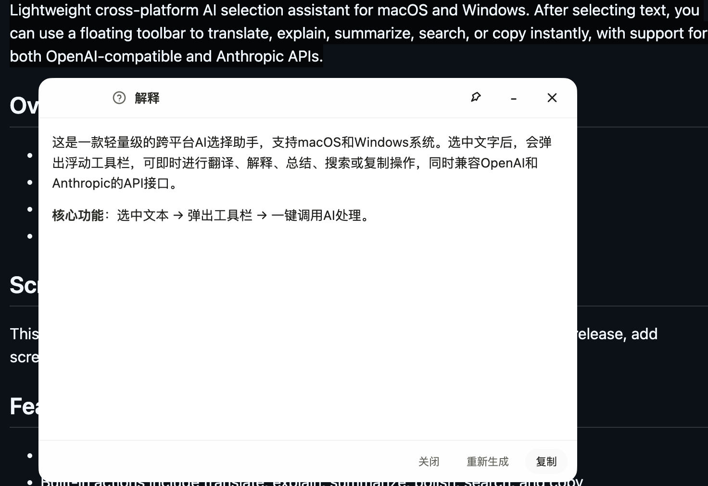
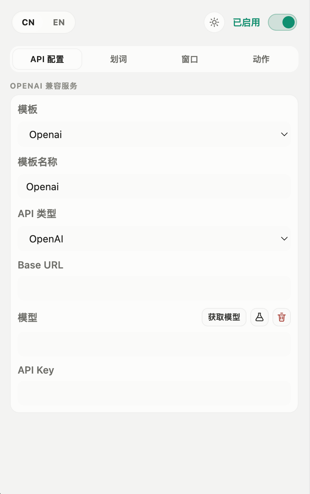
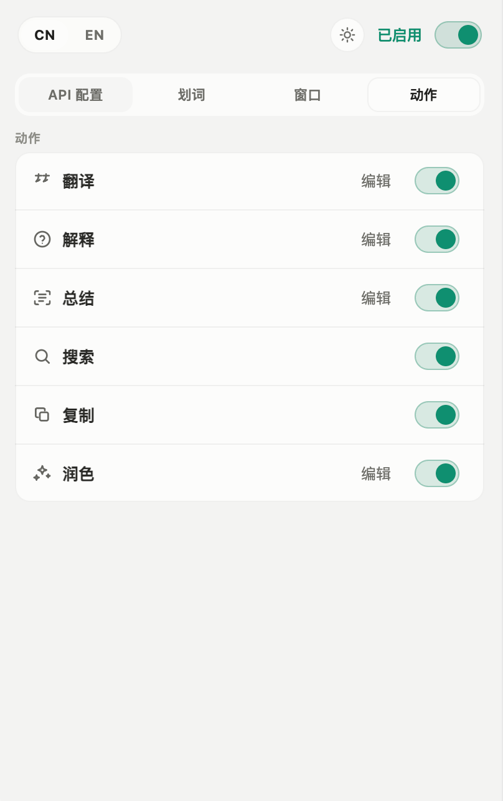
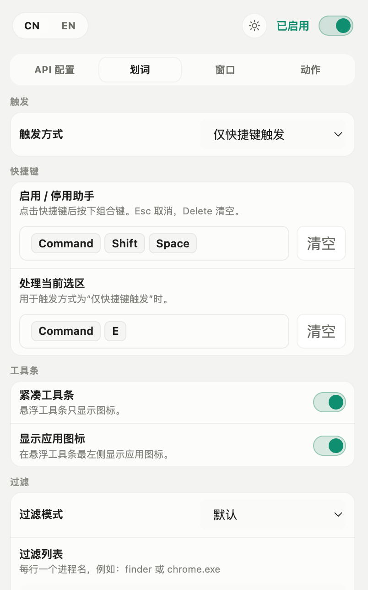
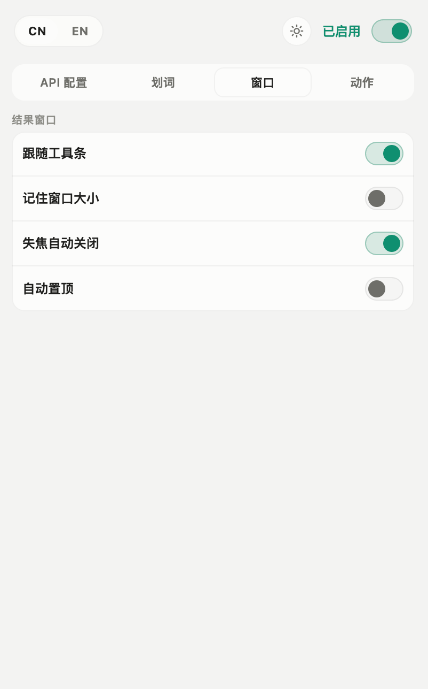

<div align="center">
  
  

  <h1>FlashAgent-assistant</h1>

  <p>划词、截图、问 AI——少切几次窗口，多省几次复制粘贴。</p>

  <p>
    
    
    
    
    
    
  </p>

  <p><a href="./README.en.md">English</a> | <strong>中文</strong></p>

  <p>
    <a href="https://github.com/XD06/FlashAgent-assistant/releases/latest"></a>
    <a href="https://github.com/XD06/FlashAgent-assistant/releases"></a>
  </p>
</div>

FlashAgent-assistant 是一个常驻菜单栏 / 系统托盘的小工具。在任意应用里选中一段文字，旁边会浮出一条工具栏，点一下就能翻译、解释、总结、润色、搜索、复制或朗读；不想用工具栏，也可以走全局快捷键。工具栏动作可以新增、重命名、换图标、改提示词、排序或删除，也能给某个动作单独绑定模型、调整思考强度，或者配置快捷键后先弹出输入框再执行。

除了划词，它还内置区域截图：拖拽框选一块屏幕，可以画线、画箭头标注，笔刷粗细随手拉滑杆调整。截完可以保存 PNG、复制到剪贴板、钉在桌面，或者直接交给 AI 识图。钉住的截图能滚轮缩放、拖拽搬位置、调整透明度，右键还能再次唤起 AI 识图。

返回窗口本身就是个独立对话——回答完了可以接着追问，AI 看得到之前的上下文；输出是流式的，可以随时打断。独立对话窗口更进一步：多话题历史记录本地保存，可切换、删除、一键导出 Markdown；对话太长时会自动把较早的消息压缩成前情摘要，上下文不爆、成本可控。还有 Agent 模式——模型可以读写文件、执行命令，每一步工具调用都要你确认（危险命令强制二次确认，毁灭性命令直接拦截），文件改动可一键回退。扩展面板里能接入记忆、Skills 技能和 MCP 服务器。需要查实时信息时打开联网搜索，AI 会自己抓网页，并在回答里附上来源链接。

模型这边可接 **OpenAI-compatible**（自建 endpoint、OpenAI、DeepSeek、月之暗面、智谱、各类第三方代理都行）或 **Anthropic** 官方 API。多套模板可一键切换 endpoint / Key / 模型，每个动作也可以指定自己的模板；API Key 只存在本地。界面支持亮 / 暗 / 跟随系统主题，中英双语都有，结果窗口的默认尺寸、字体和字号也可以在设置里调整。

目前支持 macOS 与 Windows。

## ✨ 核心优化与创新

本项目基于 [zcx960/AIA-selection-assistan](https://github.com/zcx960/AIA-selection-assistan) 二次开发，但已经远不止于划词翻译——以下能力均为本仓库新增或重写，是区别于原项目的关键：

### 🧠 工业级上下文工程

- **token 驱动的自动压缩**：按真实 API usage（`prompt_tokens`）而非字符数触发，超过上下文预算 ~95% 时在发送下一条消息前先压缩旧历史；拿不到 usage 的供应商自动回退估算闸门，不留死角
- **五节「复工文档」压缩产物**：较早历史由 LLM 压成「原始任务 / 关键结论 / 文件状态 / 已弃方案 / 下一步」结构化摘要，路径与命令逐字保留，主进程程序化校验结构 + 重试回退链，压缩后模型可无缝接上任务
- **CJK 感知 token 估算**：中/日/韩按 ~0.7 token/字换算（通行的 `chars/4` 规则对中文低估近 3 倍），中文重度会话不再因估算失真而爆窗口
- **发送前硬上限保护**：即将静默丢弃旧消息时改为先压缩再发，摘要头部固定不被裁剪

### 🛡️ 反幻觉接地（对齐 OpenAI / Anthropic 官方标准）

- **跨轮原生工具消息回放**：历史中的工具调用不是拼成文本塞回去，而是按协议展开为原生 `tool_calls`/`tool` 消息（OpenAI）或 `tool_use`/`tool_result` 块（Anthropic），从根本上消除模型模仿文本台账、伪造工具结果的叙述型幻觉
- **工具台账防伪造**：模型自己写出的伪 `[tool: ...]` 行会被识别并剥离，不会污染后续上下文
- **分层接地规则**：系统提示明确告知模型哪些工具结果是真实回放、哪些是摘要转述，禁止编造未执行的工具结果

### 🤖 Agent 可靠性工程

- **命令三层风险分级**：毁灭性命令无条件拦截，危险命令任何模式下强制二次确认，完全访问模式也绕不过安全闸门
- **文件改动快照落盘**：跨应用重启仍可一键回退任意一次工具修改
- **工具参数前置校验 + 自纠**：非法 JSON / 缺字段 / 类型错误直接回传可行动错误让模型自己修，不弹无效审批卡片
- **网络抖动自动重试**：429/5xx/瞬断按 1s→2s→4s 退避，长任务不因单次抖动中断
- **终端级工具输出**：解析程序原生 ANSI 颜色，编辑以标准 unified diff 展示，改动一眼可辨

### 🧪 工程质量

- **279 个单元测试**覆盖压缩触发、原生回放展开、参数校验、风险分级、ANSI 渲染等核心链路
- **真实 API 的 E2E 回归工具**（`pnpm e2e:compaction`）：用生产代码链验证 usage 采集→压缩触发→复工文档→压缩后连续性全流程

## 项目概览

- 适用于 macOS 和 Windows 的 Electron 桌面应用
- 选中文本后弹出悬浮工具栏，直接触发常用动作
- 支持系统 TTS 朗读选中文本，macOS 与 Windows 均可用
- 内置区域截图，可直接钉图、复制、保存或交给 AI 识图（识图可指定专用视觉模型）
- 独立 AI 对话窗口：多话题历史记录、长对话自动压缩、Markdown 导出
- Agent 模式：模型可调用文件读写 / 命令执行等工具，逐条确认 + 危险命令分级拦截 + 改动可回退
- 扩展系统：记忆、Skills 技能、MCP 服务器接入、权限模式
- 支持多套 API 模板，并可按动作指定模型与思考强度
- 支持自定义动作：新增、重命名、换图标、编辑提示词、排序、删除
- 支持动作输入快捷键：按快捷键弹出输入框，输入文本后直接运行指定动作
- 支持亮色、暗色、跟随系统三种主题
- 结果窗口支持 Markdown 渲染，代码块可复制，长行自动换行

## 截图

### 交互体验

<p>
  
  
</p>

### API 与动作配置

<p>
  
  
</p>

### 划词与窗口设置

<p>
  
  
</p>

## 功能特性

- 选中文本后直接弹出悬浮工具栏
- 内置翻译、解释、总结、润色、搜索、复制、朗读等动作，也可添加自己的动作
- 支持多个 API 模板，切换模型和服务商更方便
- 每个提示词动作可单独选择 API 模板，并独立设置思考强度
- 每个动作可配置输入快捷键，不需要先选中文本也能快速运行
- 工具栏可切换紧凑模式，也能隐藏 app 图标
- 应用关闭后最小化到状态栏或系统托盘，不会直接退出

### 截图

- 全局快捷键唤起截图，鼠标拖拽框选区域即可
- 截完可选：AI 识图、复制到剪贴板、保存为 PNG，或钉在桌面
- 钉住的图片支持滚轮缩放、拖拽移动、右键菜单调整透明度 / 重置 / 关闭
- 钉图右键也能直接「AI 识图」，把图片送进识图对话

### AI 对话与追问

- 独立的对话窗口，与悬浮工具栏的单次结果窗解耦
- 多话题历史记录：本地持久化，可切换、删除、重命名，任意一条可导出为 Markdown（自动写入下载目录并定位文件）；列表为紧凑样式，重命名 / 导出 / 删除收进右键菜单
- 话题自动命名：首轮对话结束后由模型生成简短标题，手动重命名始终优先
- 长对话自动压缩：按真实 token 用量触发（超过上下文预算的约 95% 时，会在发送下一条消息前先压缩较早历史再发送），较早消息由 LLM 压缩成五节「复工文档」（原始任务 / 关键结论 / 文件状态 / 已弃方案 / 下一步），路径与命令逐字保留，可单独指定压缩模型，界面有进度提示
- 上下文占用有实时进度环，按 token 口径显示
- 网络抖动自动重试：429 / 5xx / 瞬断按 1s→2s→4s 退避重试，长任务不因单次抖动中断
- 流式输出，回答边生成边显示，可随时中断
- Markdown 代码块支持一键复制，长代码行会自动换行
- 窗口支持「钉住」常驻

### Agent 模式与扩展

- Agent 模式下模型可调用内置工具：读写 / 编辑文件（支持批量替换）、执行命令、列目录等；开启后可为本次会话选择工作目录
- 跨轮历史中的工具调用以原生协议消息回放（OpenAI `tool_calls`/`tool`、Anthropic `tool_use`/`tool_result`），配合台账防伪造剥离，多轮之后模型不会退化成叙述式幻觉
- 工具参数会先做校验：非法 JSON、缺字段、类型不符会直接回传可行动的错误让模型自纠，不会以空参数静默执行或弹出无效审批卡片
- `edit_file` 匹配可容忍换行符（CRLF / LF）与行尾空白差异（缩进仍需完全一致），失败时给出行号级诊断；`read_file` 会标注文件换行符类型（CRLF / LF）
- 每次工具调用需逐条确认，可在会话内选择「始终允许」
- 命令三层风险分级：毁灭性命令（如 `rm -rf /`、`format c:`）无条件拦截；危险命令（如 `rm`、`git reset --hard`）任何模式下都要二次确认
- 文件改动自动快照并落盘，应用重启后仍可一键回退
- 工具输出终端化渲染：解析程序原生 ANSI 颜色，编辑 / 写入以标准 unified diff 展示（旧行红、新行绿），改动一眼可辨
- Windows 无 Git Bash 时命令工具自动回退 PowerShell，工具描述随实际 shell 动态调整
- 扩展面板：记忆（写入需确认）、Skills 技能、MCP 服务器（工具调用恒需确认）、权限模式（可开完全访问，危险拦截不受影响）
- 功能模型：识图、压缩可分别绑定固定模型，动作也可单独覆盖模型名；上下文窗口大小可在设置里按所用模型填写（默认 128000 tokens）

## 平台与权限说明

### macOS

- 需要授予辅助功能权限，应用才能检测系统级划词
- 关闭主窗口后会缩到顶部状态栏
- 首次使用建议手动测试一下划词唤起和窗口显示效果

### Windows

- 支持系统托盘驻留
- 关闭主窗口后会缩到托盘，不会直接退出
- 划词监听效果可能会受目标应用、管理员权限或输入法状态影响
- 未安装 Git Bash 时，Agent 的命令工具会自动改用 PowerShell

## 安装与本地开发

### 前置要求

- 推荐 Node.js 20+
- `pnpm` 10+
- 想完整验证功能，建议直接在 macOS 或 Windows 上运行

### 安装依赖

```bash
pnpm install
```

### 开发模式

```bash
pnpm dev
```

### 测试

```bash
pnpm test
pnpm typecheck
```

可选：`pnpm e2e:compaction` 用本机已配置的真实 API 跑上下文压缩全链路回归（会发少量真实请求，详见 `sandbox-e2e/README.md`）。

### 构建

```bash
pnpm build
```

## 打包命令

```bash
pnpm dist:mac
pnpm dist:win
```

说明：

- 打包产物不会提交到 git 仓库
- 如果要给别人分发安装包，建议通过 GitHub Releases 发布

## 配置说明

### API 支持

- OpenAI-compatible：使用 `/chat/completions` 与 `/models`
- OpenAI-compatible 的 Base URL 建议填到 API 根路径（例如 `https://api.example.com/v1`）；如果粘贴了完整 `/chat/completions` 或 `/models` endpoint，应用会自动归一化
- Anthropic：使用 `/v1/messages` 与 `/v1/models`
- Anthropic 模式下，Base URL 只需要填基础地址，不用手动补 `/v1`

### API 模板

- 可新增、重命名、删除多个 API 模板
- 每个模板会保存 API 类型、Base URL、API Key 和模型名
- 模板支持获取模型列表、模型测活，并可设为默认模板
- 动作可以跟随默认模板，也可以指定某个模板单独运行

### 动作配置

- 内置动作可编辑、停用、排序；自定义动作还可以删除
- 提示词动作支持自定义提示词、图标、模型模板和思考强度
- 搜索动作支持自定义搜索 URL 模板
- 朗读动作使用系统 TTS，托盘菜单可停止当前朗读
- 动作快捷键会打开输入窗口，输入文本后用对应动作一次性运行

### 主题与界面

- 支持亮色、暗色、跟随系统
- 工具栏支持紧凑模式
- 工具栏可控制是否显示 app 图标
- 结果窗口支持设置默认宽高、字体名称和字号
- 安装版支持开机自启；登录启动时会静默驻留到状态栏 / 托盘
- 设置页分成 API 配置、划词、窗口、动作 四个分区

## 隐私说明

- 只有你主动触发 AI 动作时，选中的文本才会发送到你配置的 API 服务
- API Key 存储在本地 Electron Store 配置中
- 仓库里不会包含你的本地配置、依赖目录或打包产物

## 已知限制

- 系统级划词能力依赖第三方 `selection-hook`，不同应用里的稳定性会有差异
- Linux 目前还不是正式支持平台
- 某些输入法或特殊应用环境下，划词位置和窗口跟随效果可能不完全一致
- 目前只支持 OpenAI-compatible 和 Anthropic 两类接口

## 贡献

欢迎提 issue 或 pull request。开始之前建议先看一下 [CONTRIBUTING.md](./CONTRIBUTING.md)。

## 🙏 Acknowledgments

- 本项目基于 [zcx960/AIA-selection-assistan](https://github.com/zcx960/AIA-selection-assistan) 二次开发，感谢原作者的工作
- [LINUX DO](https://linux.do/) — Community support and inspiration

## 安全

如果你发现安全问题，请不要直接公开提 issue，先阅读 [SECURITY.md](./SECURITY.md)。

## 许可证

本项目基于 [MIT License](./LICENSE) 开源。
