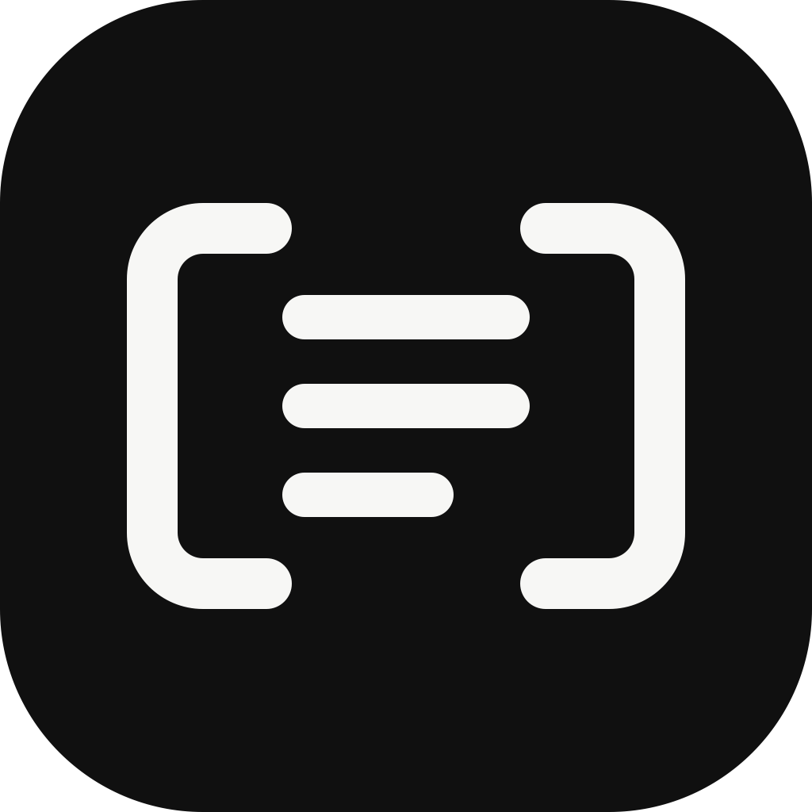

<p align="center">
  
</p>

# AIA划词助手

[English README](./README.en.md)

`AIA划词助手` 是一个轻量级桌面工具，适合在阅读、写作、翻译、查资料时随手调用 AI。你在任意应用里选中文本后，它会弹出一个小工具栏，让你直接翻译、解释、总结、搜索或复制，不用来回切应用。

项目目前支持 macOS 和 Windows，也支持接入 OpenAI-compatible 与 Anthropic API。整体目标很简单：常驻够轻，唤起够快，配置别太折腾。

## 项目概览

- 适用于 macOS 和 Windows 的 Electron 桌面应用
- 选中文本后弹出悬浮工具栏，直接触发常用动作
- 支持 API 模板，方便切换模型、Key 和服务商
- 支持亮色、暗色、跟随系统三种主题
- 结果窗口支持 Markdown 渲染

## 截图

### 交互体验

<p>
  
  
</p>

### API 与动作配置

<p>
  
  
</p>

### 划词与窗口设置

<p>
  
  
</p>

## 功能特性

- 选中文本后直接弹出悬浮工具栏
- 内置翻译、解释、总结、润色、搜索、复制等动作
- 支持多个 API 模板，切换模型和服务商更方便
- 工具栏可切换紧凑模式，也能隐藏 app 图标
- 应用关闭后最小化到状态栏或系统托盘，不会直接退出

## 平台与权限说明

### macOS

- 需要授予辅助功能权限，应用才能检测系统级划词
- 关闭主窗口后会缩到顶部状态栏
- 首次使用建议手动测试一下划词唤起和窗口显示效果

### Windows

- 支持系统托盘驻留
- 关闭主窗口后会缩到托盘，不会直接退出
- 划词监听效果可能会受目标应用、管理员权限或输入法状态影响

## 安装与本地开发

### 前置要求

- 推荐 Node.js 20+
- `pnpm` 10+
- 想完整验证功能，建议直接在 macOS 或 Windows 上运行

### 安装依赖

```bash
pnpm install
```

### 开发模式

```bash
pnpm dev
```

### 测试

```bash
pnpm test
pnpm typecheck
```

### 构建

```bash
pnpm build
```

## 打包命令

```bash
pnpm dist:mac
pnpm dist:win
```

说明：

- 打包产物不会提交到 git 仓库
- 如果要给别人分发安装包，建议通过 GitHub Releases 发布

## 配置说明

### API 支持

- OpenAI-compatible：使用 `/chat/completions` 与 `/models`
- Anthropic：使用 `/v1/messages` 与 `/v1/models`
- Anthropic 模式下，Base URL 只需要填基础地址，不用手动补 `/v1`

### API 模板

- 每个模板会保存 API 类型、Base URL、API Key 和模型名
- 切换模板后，当前 provider 配置会立即一起切换

### 主题与界面

- 支持亮色、暗色、跟随系统
- 工具栏支持紧凑模式
- 工具栏可控制是否显示 app 图标
- 设置页分成 API 配置、划词、窗口、动作 四个分区

## 隐私说明

- 只有你主动触发 AI 动作时，选中的文本才会发送到你配置的 API 服务
- API Key 存储在本地 Electron Store 配置中
- 仓库里不会包含你的本地配置、依赖目录或打包产物

## 已知限制

- 系统级划词能力依赖第三方 `selection-hook`，不同应用里的稳定性会有差异
- Linux 目前还不是正式支持平台
- 某些输入法或特殊应用环境下，划词位置和窗口跟随效果可能不完全一致
- 目前只支持 OpenAI-compatible 和 Anthropic 两类接口

## 贡献

欢迎提 issue 或 pull request。开始之前建议先看一下 [CONTRIBUTING.md](./CONTRIBUTING.md)。

## 安全

如果你发现安全问题，请不要直接公开提 issue，先阅读 [SECURITY.md](./SECURITY.md)。

## 许可证

本项目基于 [MIT License](./LICENSE) 开源。
