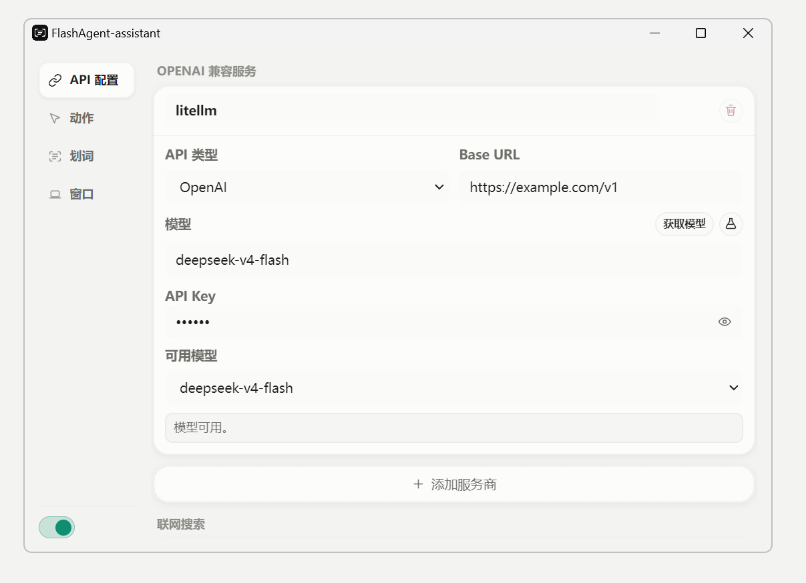
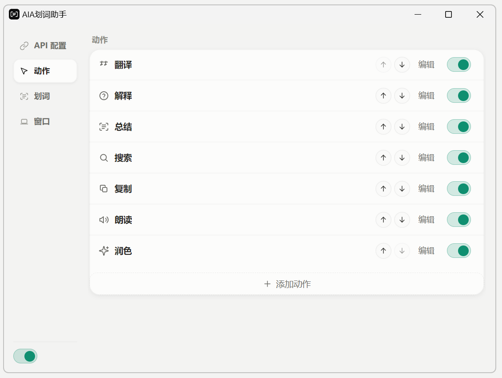
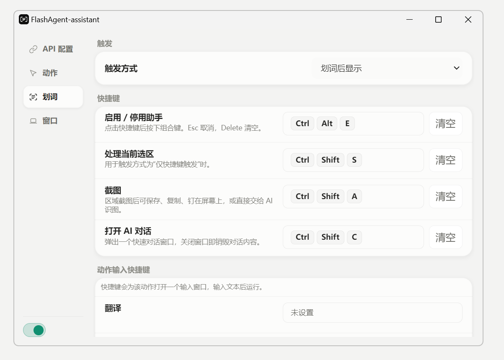
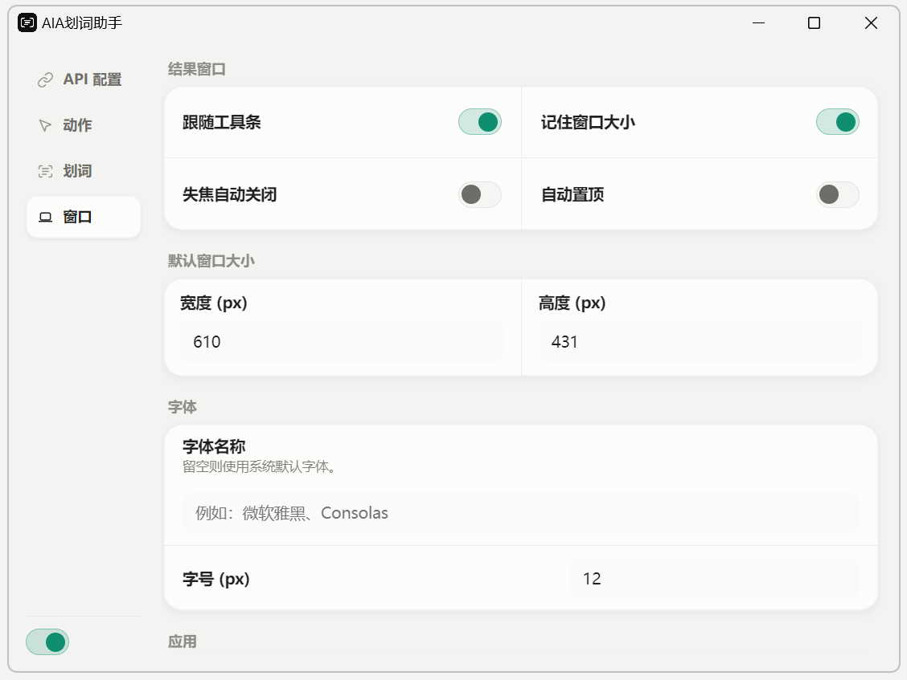
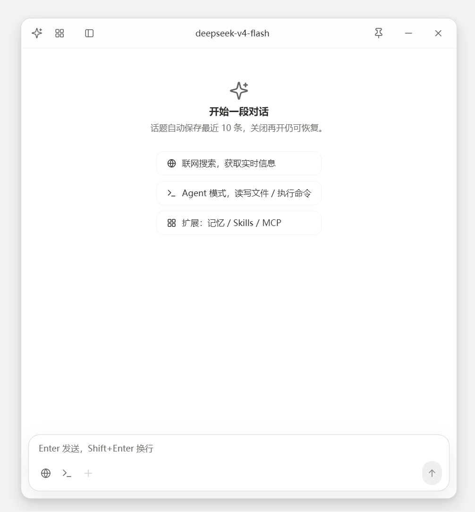
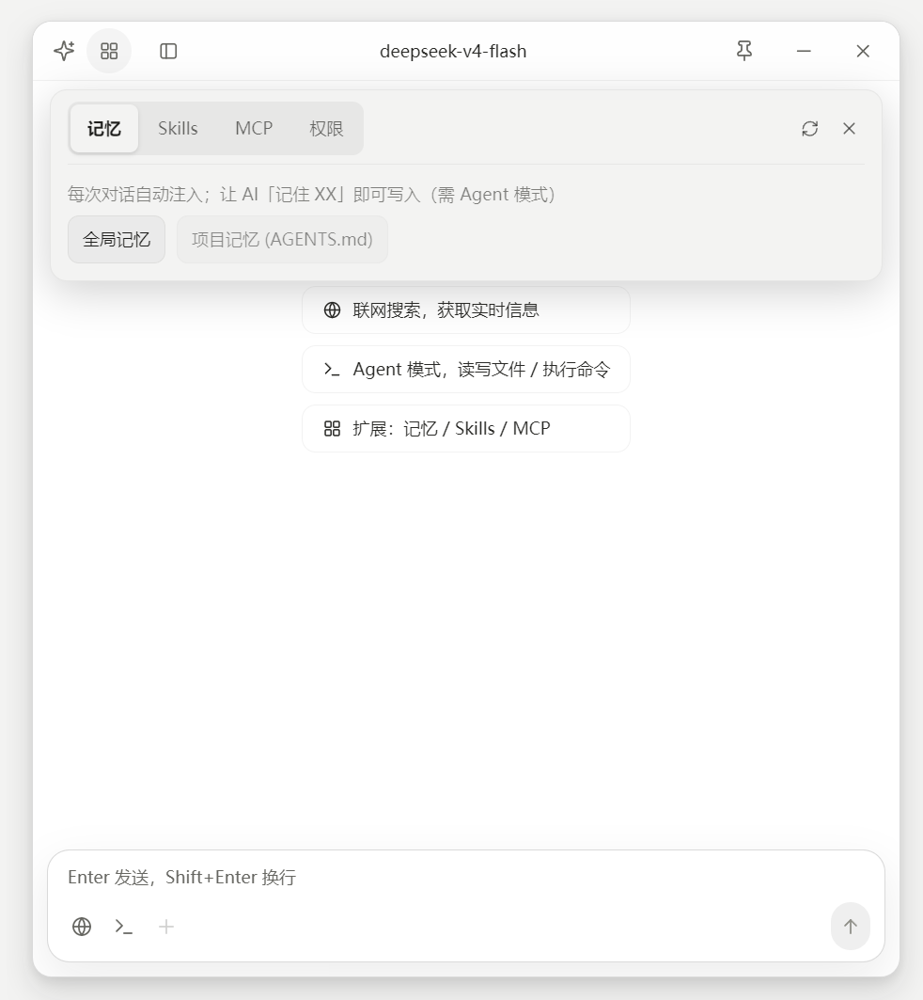
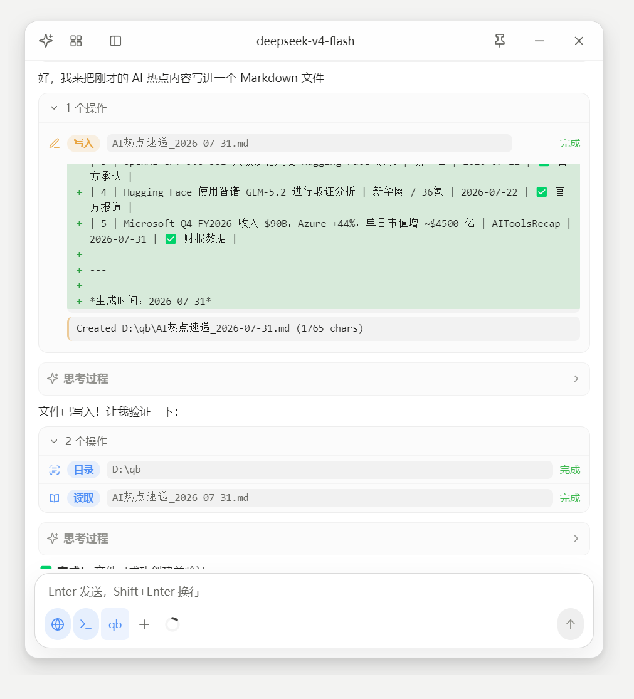
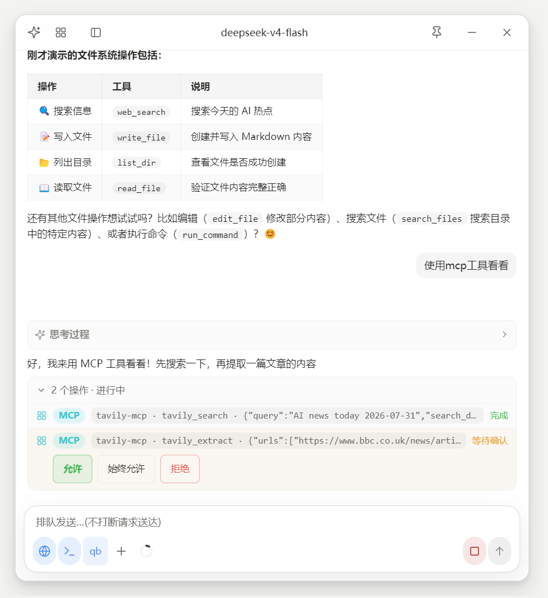

<div align="center">
  
  

  <h1>FlashAgent-assistant</h1>

  <p>划词即问、截图即懂、轻量 Agent 即刻开工。</p>

  <p>
    
    
    
    
    
  </p>

  <p><a href="./README.en.md">English</a> | <strong>中文</strong></p>

  <p>
    <a href="https://github.com/XD06/FlashAgent-assistant/releases/latest"></a>
    <a href="https://github.com/XD06/FlashAgent-assistant/releases"></a>
  </p>
</div>

FlashAgent-assistant 是面向快速问答与轻量 Agent 工作流的桌面 AI 助手，运行在菜单栏或系统托盘中。选中任意文本即可翻译、解释、总结、润色、搜索、复制或朗读，无需在应用间反复复制粘贴；区域截图可直接标注、保存、复制、钉在桌面，或交给 AI 识图。独立对话窗口支持多话题、本地历史、流式输出、追问和 Markdown 导出。

本项目基于 [zcx960/AIA-selection-assistan](https://github.com/zcx960/AIA-selection-assistan) 二次开发。FlashAgent-assistant 在保留划词工作流的基础上，扩展了可配置的模型服务、视觉识图、Agent 工作流、上下文压缩、联网搜索、Skills 与 MCP 集成等能力。上游项目的授权与鸣谢信息保留在本文档和 [LICENSE](./LICENSE) 中。

## 核心能力

- **快速问答与划词操作**：浮动工具栏、内置和自定义动作、动作专属快捷键、系统 TTS，以及紧凑模式；选中内容即可就地提问。
- **快速翻译与生词本**：快捷键呼出轻量翻译窗，内置微软 / 金山 / DeepLX 免 Key 引擎并行翻译、金山词霸词典与 Edge TTS 朗读（无需大模型接口）；查过的英文单词可自动或手动收进生词本，支持网格预览、词典详情、搜索与 Markdown 导出。
- **多模型配置**：支持 OpenAI-compatible 与 Anthropic API；可维护多个服务商模板，并为动作、识图和压缩分别指定模型。
- **截图与识图**：区域截图支持画笔和箭头标注，可保存、复制、钉图和送入 AI 视觉对话；原图可在结果窗中展开查看。
- **对话与上下文**：多话题本地历史、自动命名、Markdown 导出和 token 驱动的长对话压缩；压缩摘要保留任务、事实、文件状态和下一步。
- **轻量 Agent 与扩展**：需要处理文件、目录、命令或联网搜索时，可在独立对话中快速进入 Agent 流程；工具调用逐项确认，危险命令分级拦截，文件改动可回退；支持记忆、Skills 与 MCP 服务器。
- **桌面体验**：亮色、暗色和跟随系统主题，中英双语，结果窗口大小和字体可调，macOS 与 Windows 均可使用。

## 界面预览

以下截图展示当前版本 FlashAgent-assistant 的设置界面。

### 设置

<p>
  
  
</p>

<p>
  
  
</p>

### Agent 工作流

<p>
  
  
</p>

<p>
  
  
</p>

### AI 识图

<p>
  
</p>

## 平台说明

### macOS

- 需要授予辅助功能权限，应用才能检测系统级划词。
- 关闭主窗口后，应用会驻留在菜单栏。

### Windows

- 支持系统托盘驻留，关闭主窗口不会直接退出应用。
- 划词监听效果可能受目标应用、管理员权限或输入法状态影响。
- 未安装 Git Bash 时，Agent 命令工具会自动回退到 PowerShell。

## 安装与开发

### 前置条件

- Node.js 20+
- pnpm 10+
- macOS 或 Windows，用于验证完整的桌面功能

### 本地运行

```bash
pnpm install
pnpm dev
```

### 验证与构建

```bash
pnpm test
pnpm typecheck
pnpm build
```

`pnpm e2e:compaction` 会使用本机已配置的真实 API 运行上下文压缩回归，产生少量真实请求；详情见 [sandbox-e2e/README.md](./sandbox-e2e/README.md)。

### 打包

```bash
pnpm dist:mac
pnpm dist:win
```

打包产物不应提交到 Git。公开分发建议通过 [GitHub Releases](https://github.com/XD06/FlashAgent-assistant/releases)。

## 配置与隐私

- API Key、模型模板、话题记录、记忆和本地工具快照均保存在本机用户数据目录。
- 只有主动触发 AI 动作时，选中文本、截图或对话内容才会发送给你配置的服务商。
- OpenAI-compatible 服务建议填写 API 根路径，例如 `https://api.example.com/v1`；完整的 `/chat/completions` 或 `/models` 地址会被自动归一化。
- Anthropic 配置只需填写基础地址，应用会补全 `/v1`。

项目更名后，首次启动会将旧 `selection-assistant-lite` 用户数据目录复制到新的 `flashagent-assistant` 目录；如果新目录已经存在，则不会覆盖任何内容。

## 项目文档

- [CHANGELOG.md](./CHANGELOG.md)：版本变更记录。
- [docs/QUICK-TRANSLATE.md](./docs/QUICK-TRANSLATE.md)：快速翻译、语音合成与生词本的架构说明。
- [CONTRIBUTING.md](./CONTRIBUTING.md)：开发与贡献约定。
- [SECURITY.md](./SECURITY.md)：安全问题披露方式。
- [docs/ARCHIVE.md](./docs/ARCHIVE.md)：历史方案与实施记录索引。

## 贡献、致谢与许可证

欢迎提交 issue 和 pull request。提交前请阅读 [CONTRIBUTING.md](./CONTRIBUTING.md)。

- 上游项目：[zcx960/AIA-selection-assistan](https://github.com/zcx960/AIA-selection-assistan)，感谢原作者的工作。
- 社区支持：[LINUX DO](https://linux.do/)。
- 本项目基于 [MIT License](./LICENSE) 开源；分发本项目或其重要部分时，请保留许可证和版权声明。
