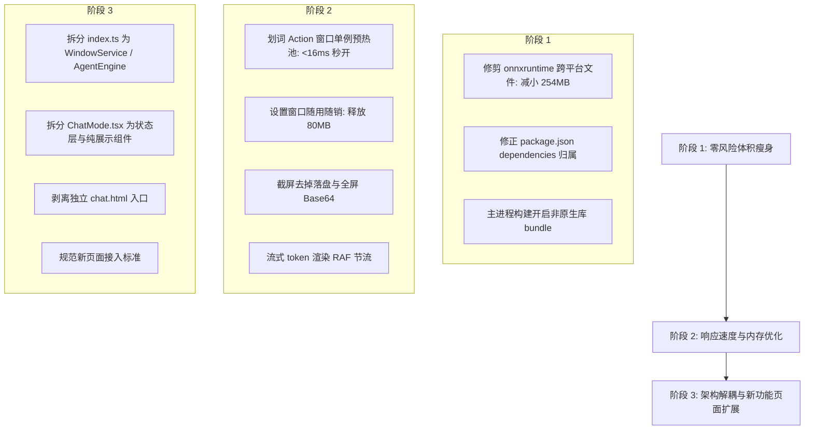

# FlashAgent-assistant v0.8.1 性能深度审查与架构重构建议

> **[已归档 · 已消化]** 四份独立审查之一。逐条核查结论并入 [PERF-EXECUTION-PLAN-2026-09-03.md](./PERF-EXECUTION-PLAN-2026-09-03.md)，0.8.2 已落地；本文含已证伪建议（如 `setVisualSearchActive`，Electron 33 无此 API），勿直接采信，见执行文档第三节。

> **审查基准**：v0.8.1 · Electron 33 · React 18 · electron-vite  
> **审查日期**：2026-09-03  
> **审查专家**：Antigravity (Google DeepMind)  
> **审查原则**：严格以实际代码与 `dist/` 真实构建产物为准，拒绝假定与文档偏见；保持现有功能 100% 不受破坏，面向未来新增页面提供架构支撑。

---

## 一、 真实测量基线（v0.8.0 vs v0.8.1）

通过对本地项目实际代码目录、`node_modules/` 以及 `dist/win-unpacked` 产物的递归度量，核心指标如下：

| 关键指标 | v0.8.0 历史基准 | v0.8.1 实测现状 | 变动原因与瓶颈定位 |
| :--- | :--- | :--- | :--- |
| **便携版安装包 (`dist/*.exe`)** | **~90 MB** | **195.8 MB** (+105.8MB, +117%) | 离线 OCR 引入后，打包脚本未剔除跨平台二进制 |
| **解压运行目录 (`win-unpacked`)** | ~280 MB | **589.7 MB** | `resources/` 占 360.6 MB，主程序自身 180.1 MB |
| **`app.asar.unpacked` (原生依赖)** | ~3 MB | **319.7 MB** | `onnxruntime-node/bin` (282.5MB) + `@napi-rs` (36.7MB) |
| **`app.asar` (主进程与依赖)** | ~18 MB | **40.8 MB** (4,277 个文件) | 主进程外部化导致未打包生产依赖，React 误入生产包 |
| **`node_modules` (本地磁盘占用)** | ~1.0 GB | **1.1 GB** | `onnxruntime-node` (283M) + `electron` (271M) + `mermaid` 系列 (100M+) |
| **常驻内存 (RSS 综合)** | 180~250 MB | **320~580 MB** | 设置页隐藏不销毁、多窗口渲染进程累积；OCR 突发 200MB；4K截图内存峰值 |
| **划词动作弹窗响应延迟** | 350~500 ms | **300~600 ms** | 窗口频繁销毁与冷启动；重新初始化 React 运行时 |
| **单文件最大行数** | - | `ChatMode.tsx` **2,426 行** (107KB)<br>`index.ts` **1,155 行** (50KB) | 逻辑高度耦合，缺乏模块化与状态拆分 |

---

## 二、 关键问题深度剖析

### 1. 依赖与打包体积暴增：打包泄漏跨平台二进制（核心元凶）

在 `dist/win-unpacked/resources/app.asar.unpacked` 下深入分析发现：
- **`node_modules/onnxruntime-node/bin` 单目录高达 282.55 MB**。
- 展开其目录结构，发现了大量非 Windows x64 的平台库：
  - macOS 动态库：`libonnxruntime.1.dylib` (43.8MB) + `libonnxruntime.1.29.0.dylib` (43.8MB) = **87.6 MB**
  - Linux 动态库：`libonnxruntime.so.1` (44.7MB + 24.5MB) = **69.2 MB**
  - GPU/DirectML 依赖：`DirectML.dll` (18.5MB) + `dxcompiler.dll` (22.2MB) + `dxil.dll` (1.7MB) = **42.4 MB**
  - Windows arm64 架构相关库等。
- **根本原因**：
  在 `scripts/after-pack.mjs` 中，构建脚本仅调用了 `prune-selection-hook-win.js` 清理 `selection-hook` 的跨平台库，而**完全遗漏了 `onnxruntime-node` 的清理**。
  实际上，在 Windows x64 纯 CPU 推理下，只需保留：
  - `onnxruntime.dll` (27.9 MB)
  - `onnxruntime_binding.node` (298 KB)
  其余 **254.3 MB** 的文件全部为无效死重！直接导致安装包体积翻倍。

### 2. 依赖分类与构建策略缺陷：4,000+ 散碎文件进入 `app.asar`

- **React 生产运行时倒灌主进程**：
  在 `package.json` 中，`react` 和 `react-dom` 声明在 `"dependencies"` 中。
  由于 `electron-builder` 默认打包策略会将 `dependencies` 完整拷入 `app.asar/node_modules`，而 Vite 前端构建已经将 React 打包进 `out/renderer/*.js`，导致主进程的 asar 镜像中白白塞入了完整的 React 运行时及 scheduler。
- **主进程外部化策略（`externalizeDepsPlugin`）的副作用**：
  `electron.vite.config.ts` 中主进程开启了 `externalizeDepsPlugin()`。
  导致 `@modelcontextprotocol/sdk`（连同传递依赖 `hono`、`zod` 642个文件、`ajv` 404个文件等）未做 Rollup 打包与 Tree-shaking，以原生 node_modules 目录结构散装打入 `app.asar`，产生了 4,277 个散碎小文件。应用冷启动时 Node.js 在 asar 虚拟文件系统中查找并读取成百上千个小文件，直接拖慢了主进程启动速度。
- **Mermaid 重型可视化库的膨胀**：
  `mermaid` 在 `node_modules` 中加上 `cytoscape`、`dagre`、`@mermaid-js` 超过 100MB，打出了 40 多个分包（甘特图、思维导图、C4架构图等）。对于轻量划词工具，绝大多数图表属于极低频需求。

### 3. 内存驻留与峰值抖动瓶颈

- **设置窗口幽灵常驻**：
  `src/main/index.ts:178-183`：
  ```typescript
  settingsWindow.on('close', (event) => {
    if (isQuitting) return
    event.preventDefault()
    settingsWindow?.hide()
    app.dock?.hide()
  })
  ```
  设置窗口包含了 59KB 的复杂表单组件和样式，用户打开一次后， Chromium 渲染进程将永久驻留后台，白白消耗 **60~80 MB** 物理内存。
- **截屏高分辨率 Base64 内存雪崩**：
  `src/main/capture.ts` 截图生成 `NativeImage` 后，在 `ScreenshotService.ts:153` 调用 `image.toDataURL()`。
  在 2K/4K 分辨率屏幕下，单帧未压缩位图达到 30MB+，编码后的 Base64 字符串长达数千万字符。跨进程 IPC 发送一次、渲染端接收一次、保存状态一次，短时间内在 V8 堆中产生 **100MB~200MB 的内存峰值**。这是主进程不得不配置 `--max-old-space-size=512` 抑制 OOM 的根本原因。
- **OCR 引擎 200MB 物理常驻**：
  `ppu-paddle-ocr` 底层加载了 Skia 图像引擎与 ONNX 模型，初始化即占用 ~200MB RSS。虽然配置了 3 分钟空闲销毁，但在使用期内内存压力巨大。

### 4. 运行速度与交互体验瓶颈

- **划词动作窗口冷启动延迟**：
  `src/main/SelectionService.ts` 中，结果窗口在关闭或失焦后会被销毁。用户每次在工具栏点击“翻译”或“解释”，都必须经历完整的 `new BrowserWindow` -> 加载 HTML -> 执行 JS -> React 挂载 -> `ready-to-show`，耗时 300~600ms，肉眼可察觉明显的弹窗迟滞感。
- **截屏落盘 IO 耗时**：
  `capture.ts` 当前截屏流程：调用外部 `CaptureScreen.exe` 进程 -> GDI 抓屏后将位图编码为 PNG 写磁盘临时文件 -> Node.js 主进程读回磁盘文件为 `NativeImage` -> 删除临时文件。多了一次无意义的磁盘编码读写与进程上下文切换，且容易受杀毒软件实时扫描拦截拖慢。
- **流式输出全量组件 Re-render**：
  在 `src/renderer/chat/ChatMode.tsx` 中，大模型流式响应高频推送 token（每秒数十次）。每次 chunk 到来都会触发顶层 `setChat`，导致包含 2,426 行代码的巨大组件树全量 Re-render，长对话时打字机效果出现掉帧与高 CPU 占用。

### 5. 架构维护性危机（对新增功能页的阻碍）

- **上帝组件 `ChatMode.tsx` (2,426 行 / 107KB)**：
  单文件内混杂了：话题历史持久化、模型列表与缓存、流式调度与中止、中间输入注入、工具审批流、文件 Diff 视图、终端 ANSI 语法高亮、上下文测量仪表盘、Markdown 导出、图片/文件拖拽解析。几乎没有任何模块化解耦，新增任何功能面板都会导致状态交叉污染。
- **上帝入口 `src/main/index.ts` (1,155 行 / 50KB)**：
  主进程的窗口管理、托盘、快捷键、Agent 50轮循环执行器、快照回滚、流式客户端、历史压缩摘要全部塞在同一个文件内。新增功能页面如果需要注册新的主进程 IPC，代码复杂度将呈指数级上升。
- **多职责混杂的 `selectionAction.html`**：
  同一个 HTML 入口，内部既用来渲染超轻量的划词结果/AI识图（`SelectionResult`/`InputResult`），又在无 payload 时渲染全功能的独立对话窗口（`ChatMode`）。两者定位完全相悖（一个要求极速毫秒级展示，一个要求复杂的工作流支持）。
- **单体全局样式表 `styles.css` (88KB)**：
  所有窗口共用一个没有命名空间或模块化的巨型 CSS，连仅需几十个图标的微型悬浮工具栏也全量引入了 88KB 样式。

---

## 三、 系统性优化建议（保持原有功能 100% 完整）

### 建议 1：安装包与依赖瘦身（预计便携版降回 ~85 MB，解压目录降低 50%+）

1. **补全 `scripts/after-pack.mjs` 中的裁剪逻辑**：
   在打包 Windows x64 产物后，递归删除 `app.asar.unpacked/node_modules/onnxruntime-node/bin` 中所有包含 `darwin`、`linux`、`arm64` 以及 `DirectML.dll`、`dxcompiler.dll` 的非必要文件。
   *收益：立即消除约 254 MB 解压体积，便携版直接缩减约 50~60 MB。*
2. **修正 `package.json` 依赖分类**：
   将 `react`、`react-dom`、`@types/*` 全部移至 `devDependencies`。同时在 `electron-builder.yml` 中明确指定主进程生产依赖范围，禁止纯前端运行时打包进 `app.asar`。
3. **主进程依赖按需 Bundle**：
   在 `electron.vite.config.ts` 中调整主进程构建配置，除 `selection-hook` 与 `onnxruntime-node` 两个包含 `.node` 扩展的依赖保留 external 外，将纯 JS 依赖（如 `@modelcontextprotocol/sdk`、`electron-store`、`undici`）由 Rollup 捆绑打包成单文件。
   *收益：`app.asar` 文件数量从 4,200+ 缩减至数十个，体积减小 25MB+，消除冷启动磁盘 IO 瓶颈。*
4. **推进 OCR 双引擎分级策略**：
   利用根目录现有的 `ocr-winrt-test-result.md` 验证成果：
   - **默认/轻量模式**：使用 Windows 内置 `Windows.Media.Ocr`（0 依赖、0 体积、0 内存加载，适合日常快速划词复制与常规截图）。
   - **专业/高精模式**：可选激活 `ppu-paddle-ocr`，支持按需动态下载模型资产，而不是强制打包在每个安装包中。

### 建议 2：内存极致控制（空闲常驻内存降至 100~150 MB）

1. **设置窗口改为随用随销**：
   移除 `settingsWindow` 的 `event.preventDefault()` 隐藏机制，改为关闭时直接 `destroy()`，或隐藏满 1 分钟后自动销毁。
   *收益：日常后台常驻直接释放 60~80 MB 渲染进程内存。*
2. **截屏传输切断 Base64 管道**：
   修改 `capture.ts` 与 `ScreenshotService.ts`：
   - 截屏直接生成原始位图 Buffer 或使用 Electron 内部内存协议共享，避免在 V8 堆中生成超大 Data URL 字符串。
   - 仅在用户明确点击“复制图像”或“发送给视觉模型”时，对选定裁剪区域（而非全屏）进行局部的 Base64 转换。
   *收益：消除 4K 截图时 100~200 MB 的堆内存暴涨。*
3. **启用 Chromium 闲置内存主动释放**：
   对最小化或隐藏的窗口，触发 `win.webContents.setVisualSearchActive(false)` 与后台页面休眠策略，促使 Chromium 及时将物理内存分页移出工作集。

### 3. 运行速度与交互体验优化（划词点击 < 16ms 秒开）

1. **划词结果窗口：预热隐藏单例池（Warm Pool）**：
   - 放弃“关闭即销毁、触发再创建”模式。
   - 应用启动完成后，在后台静默创建一个 Action 窗口并保持 `hide()`。
   - 用户点击动作时，主进程直接：`win.setBounds(pos) -> win.webContents.send(data) -> win.show()`。
   - 窗口展示耗时从 **300~600ms 降至 16ms（1帧内）**，达到瞬时呼出效果。
2. **截图引擎管道去磁盘化**：
   - 优化 C# helper，通过标准输出流（stdout）或内存命名管道直接向主进程传输位图像素数据，消除写磁盘 PNG 与读磁盘的昂贵 IO。
3. **流式打字机渲染节流**：
   - 在前端引入 `requestAnimationFrame` 批处理机制，流式 token 每 30~50ms 刷新一次 DOM，避免高频触发 React Diff。
   - 将正在打字的消息节点包装为局部受控组件，避免全量历史消息列表重绘。

---

## 四、 架构重构建议（为后续新增功能页面铺路）

针对用户需求：**“是否需要重构？后面我会添加新的功能页面。”**

### 核心结论
**无需推倒重写技术栈，但必须进行结构性模块解耦与服务化分层。**  
如果不进行解耦，现有单文件代码已经逼近维护极限（`ChatMode.tsx` 2426行，`index.ts` 1155行），新增页面将极易引入回归缺陷并进一步恶化启动速度。

### 1. 主进程重构方案：从“上帝脚本”转向“服务化分层”

将 `src/main/index.ts` 按职责拆解为服务层与 IPC 路由层：

```
src/main/
├── index.ts                   # 极简入口：app生命周期、单实例锁、全局异常捕获 (< 100 行)
├── services/
│   ├── WindowService.ts       # 统管所有窗口生命周期与单例预热池 (Settings, Chat, Translate, Action)
│   ├── TrayService.ts         # 系统托盘与右键菜单
│   ├── ShortcutService.ts     # 全局快捷键注册与冲突调度
│   └── AgentEngine.ts         # 从 index.ts 抽离出的 50 轮工具迭代、审批流、快照回退
└── ipc/
    ├── windowIpc.ts           # 窗口控制与定位 IPC
    ├── settingsIpc.ts         # 设置存取与变更通知
    ├── aiStreamIpc.ts         # 大模型流式调用与中间注入
    ├── agentIpc.ts            # Agent 权限审批与工具执行
    └── [newPage]Ipc.ts        # 🌟 后续新功能页面独立的 IPC 注册模块
```

**新增功能页面规范（主进程）**：  
未来每增加一个新功能页面，只需在 `WindowService` 中配置该窗口的规格与生命周期策略，并在 `src/main/ipc/` 下增加一个对应的 `[feature]Ipc.ts`，主入口 `index.ts` 完全无需变动。

### 2. 渲染进程重构方案：肢解 `ChatMode.tsx` (2,426 行)

将巨型组件按领域模型拆分，消除层层 props 传递：

```
src/renderer/chat/
├── ChatMode.tsx               # 纯布局外壳容器 (< 120 行)
├── store/
│   └── useChatStore.ts        # 使用 Zustand (体积仅 1KB) 或精简 Context 统一管理 Topics、Turns、Streaming 状态
├── hooks/
│   ├── useChatStream.ts       # 抽离流式网络处理、Abort 与注入逻辑
│   ├── useTopicPersistence.ts # 抽离话题本地持久化与自动命名
│   └── useToolApproval.ts     # 抽离工具卡片审批交互
└── components/
    ├── MessageList/           # 历史消息列表容器
    │   ├── MessageItem.tsx    # 单条消息气泡 (React.memo 深度防抖)
    │   └── StreamingBlock.tsx # 正在打字的独立节点 (隔离渲染更新)
    ├── Composer/              # 输入框、快捷发送、文件/图片附件预览
    ├── Sidebar/               # 话题历史侧边栏与模型选择器
    └── ToolCards/             # 工具卡片集合 (Diff卡片、命令行卡片、MCP卡片)
```

### 3. 页面入口架构规范（新功能页接入指引）

1. **分离 Chat 与 Action 入口**：
   - 将独立对话窗口剥离为独立的 `chat.html`，不再寄生在 `selectionAction.html` 中。
   - `selectionAction.html` 回归纯粹的轻量划词结果窗口，只保留秒开逻辑，剔除所有沉重的 Agent 代码。
2. **新功能页面的类型判断与接入规范**：
   - **类型 A：独立工作窗口（如“知识库中心”、“高级设置”、“工作流编排”）**：
     - 在 `electron.vite.config.ts` 的 `rollupOptions.input` 中注册独立的 HTML 入口（例如 `workspace.html`）。
     - 拥有独立的渲染进程，生命周期独立，防止与托盘划词产生内存耦合。
   - **类型 B：属于对话/划词工作流的辅助面板（如“生词本详情抽屉”、“Prompt 模板库”）**：
     - 作为 React 异步组件（`React.lazy`），以 Tab、Drawer 或 Modal 的形式挂载在现有页面内，避免引入新的 Chromium 进程（节省 40~60MB 内存）。

### 4. 样式解耦与治理

将 88KB 的 `src/renderer/styles.css` 拆分为模块化样式：
- `base.css`：重置样式、全局 CSS 变量（色彩/字号/主题）。
- `toolbar.css`：仅供悬浮工具栏使用的极简样式（< 5KB）。
- `chat.css`：对话窗口、Diff 视图、终端卡片专用样式。
- `settings.css`：设置表单样式。

---

## 五、 分阶段实施路线图



### 推荐实施节奏：
1. **第一周（体积瘦身）**：纯构建与打包层改动，完全不改业务代码，可直接将便携版压缩至 85~90MB，解压目录降至 300MB 以下。
2. **第二周（速度与内存）**：窗口生命周期管理优化与截屏内存传输改造，显著消除卡顿与幽灵内存。
3. **第三周（架构重构）**：按上述规范拆分 `index.ts` 与 `ChatMode.tsx`，建立新功能页面模板，为后续业务功能开发提供健康可扩展的基座。

